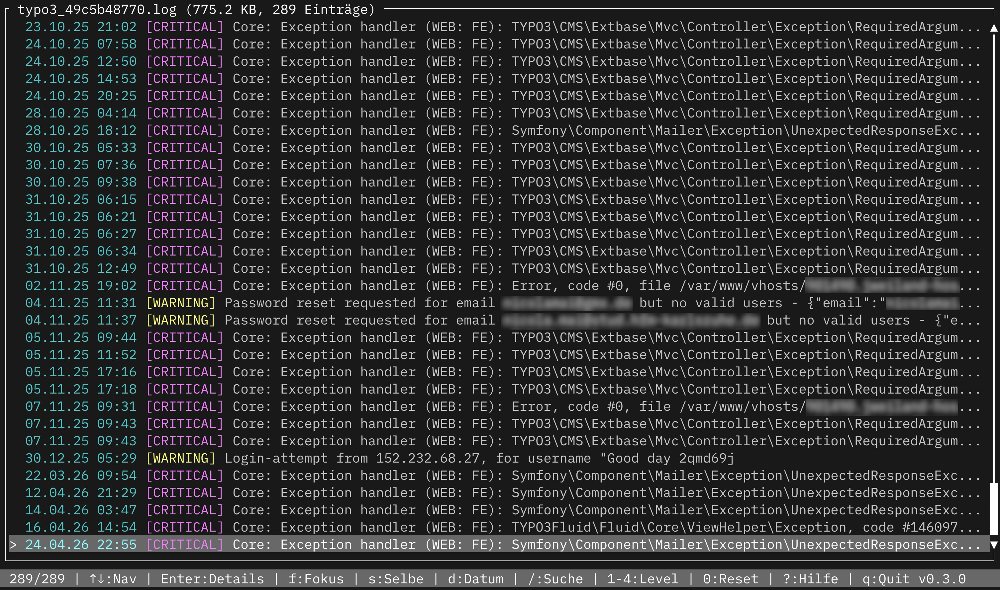
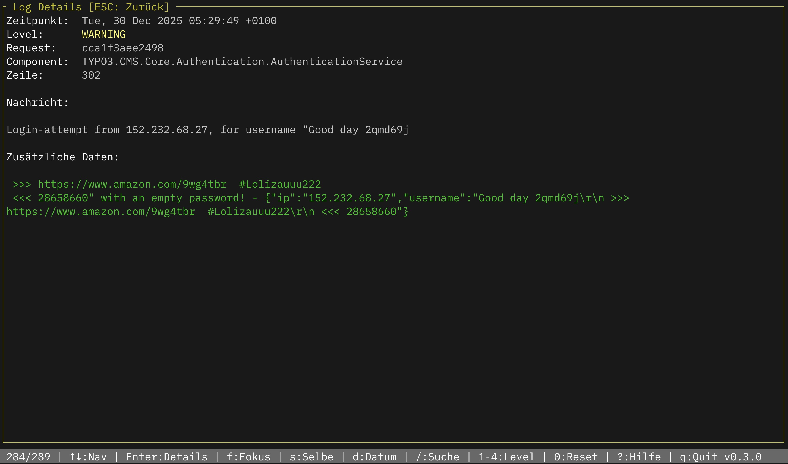

# TYPO3 Log Viewer

Interaktiver Terminal-Viewer für TYPO3-Logdateien. Schnelles Navigieren, Filtern und Analysieren direkt in der Kommandozeile — ohne Browser, ohne GUI.

  

## Features

- **Listenansicht** mit Zeitstempel, farbcodierten Log-Levels und gekürzter Nachricht
- **Detailansicht** mit vollständiger Nachricht, Request-ID, Component und Pretty-Print JSON
- **Interaktive Dateiauswahl** bei Verzeichnis-Argument — zurück zur Auswahl per ESC
- **Live-Reload** — erkennt Änderungen in der Logdatei automatisch
- **Datumsfilter** — letzter Monat, letzte 6/12 Monate oder eigener Bereich (TT.MM.JJJJ)
- **Request-Fokus** — alle Log-Einträge einer Request-ID auf einen Blick
- **Selbe Nachrichten** — filtert auf Einträge mit identischer Meldung (vor dem JSON-Block)
- **Level-Filter** — Error, Warning, Info, Debug per Tastendruck
- **Volltextsuche** über Nachricht und Component
- Farbcodierung: Error=rot, Warning=gelb, Info=grün, Debug=grau

## Screenshots





## Installation

### Homebrew (empfohlen)

```bash
brew tap rolf-thomas/tools
brew install typo3-log-viewer
```

Update:

```bash
brew update && brew upgrade typo3-log-viewer
```

### Binary direkt herunterladen

Fertige Binaries für alle Plattformen unter [Releases](https://github.com/rolf-thomas/typo3-log-viewer/releases):

| Datei | Plattform |
|-------|-----------|
| `typo3-log-viewer-*-macos-arm64.tar.gz` | macOS Apple Silicon |
| `typo3-log-viewer-*-macos-x86_64.tar.gz` | macOS Intel |
| `typo3-log-viewer-*-linux-x86_64-musl.tar.gz` | Linux x86_64 (statisch, max. Portabilität) |
| `typo3-log-viewer-*-linux-arm64.tar.gz` | Linux ARM64 |

```bash
tar -xzf typo3-log-viewer-*-macos-arm64.tar.gz
sudo mv typo3-log-viewer /usr/local/bin/
```

> **macOS Gatekeeper:** Da die Binary nur ad-hoc signiert ist, beim ersten Start einmalig ausführen:
> ```bash
> xattr -d com.apple.quarantine /usr/local/bin/typo3-log-viewer
> ```

### Aus dem Quellcode bauen

Voraussetzung: [Rust >= 1.75](https://rustup.rs/)

```bash
git clone https://github.com/rolf-thomas/typo3-log-viewer.git
cd typo3-log-viewer
./check-setup.sh   # prüft und installiert fehlende Abhängigkeiten
./build.sh         # baut und signiert die macOS-Binary
```

Die fertige Binary liegt unter `target/release/typo3-log-viewer`.

## Nutzung

```bash
# Einzelne Logdatei öffnen
typo3-log-viewer var/log/typo3.log

# Verzeichnis öffnen — interaktive Dateiauswahl
typo3-log-viewer var/log/

# Version anzeigen
typo3-log-viewer -v
```

Ohne Argument wird `./var/log/` verwendet, falls das Verzeichnis existiert.

## Tastenkürzel

### Listenansicht

| Taste | Funktion |
|-------|----------|
| `↑` / `↓`, `j` / `k` | Navigation |
| `PgUp` / `PgDown` | Seitenweises Scrollen |
| `Home` / `g` | Zum Anfang |
| `End` / `G` | Zum Ende |
| `Enter` | Detailansicht öffnen |
| `f` | Request-Fokus (alle Einträge dieser Request-ID) |
| `s` | Selbe Lognachricht (alle Einträge mit gleicher Meldung) |
| `d` | Datumsfilter-Menü |
| `/` | Volltextsuche |
| `1`–`4` | Level-Filter (1=Error, 2=Warning, 3=Info, 4=Debug) |
| `0` | Alle Filter zurücksetzen |
| `ESC` | Filter zurücksetzen / zurück zur Dateiauswahl |
| `?` | Hilfe |
| `q` | Beenden |

### Detailansicht

| Taste | Funktion |
|-------|----------|
| `↑` / `↓`, `j` / `k` | Scrollen |
| `PgUp` / `PgDown` | Seitenweises Scrollen |
| `ESC`, `Enter` | Zurück zur Liste |

### Datumsfilter-Menü (`d`)

| Taste | Funktion |
|-------|----------|
| `1` | Letzter Kalendermonat |
| `2` | Letzte 6 Monate |
| `3` | Letzte 12 Monate |
| `4` | Eigenen Datumsbereich eingeben (TT.MM.JJJJ) |
| `0` | Datumsfilter zurücksetzen |
| `ESC` | Schließen |

## Unterstütztes Log-Format

```
DATUM [LEVEL] request="REQUEST_ID" component="COMPONENT": NACHRICHT
```

Beispiel:

```
Thu, 02 Apr 2026 12:00:02 +0200 [ERROR] request="043d54b20b2e8" component="Vendor.Module.Service.ProductCrmRestService": Client error: `POST https://…` resulted in `400 Bad Request` - {"error":"invalid_grant"}
```

Mehrzeilige Einträge und JSON-Blöcke in Folgezeilen werden automatisch dem zugehörigen Eintrag zugeordnet und in der Detailansicht formatiert dargestellt.

## Lizenz

MIT
