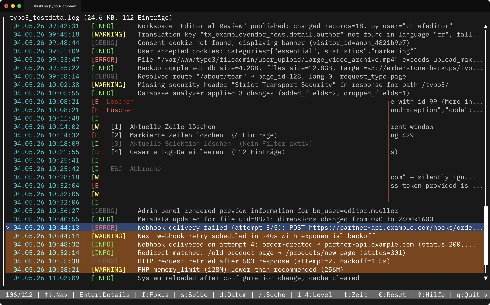

# TYPO3 Log Viewer

Interaktiver Terminal-Viewer für TYPO3-Logdateien. Schnelles Navigieren, Filtern und Analysieren direkt in der Kommandozeile — ohne Browser, ohne GUI.

  

## Features

- **Listenansicht** mit Zeitstempel, farbcodierten Log-Levels und gekürzter Nachricht
- **Detailansicht** mit vollständiger Nachricht, Request-ID, Component und Pretty-Print JSON
- **Interaktive Dateiauswahl** bei Verzeichnis-Argument — zurück zur Auswahl per ESC
- **Live-Reload** — erkennt Änderungen in der Logdatei automatisch (inkrementelles Tail-Reload, geringer Speicherverbrauch auch bei großen Dateien)
- **Lösch-Menü** — einzelne Zeile, markierten Bereich, gefilterte Selektion oder die gesamte Datei löschen (Backspace, mit Bestätigung)
- **Mehrfach-Markierung** — zusammenhängende Zeilenbereiche mit Shift+↑/↓ markieren und gemeinsam löschen
- **Zeitkorrektur** — Zeitstempel temporär um ganze Stunden verschieben (z. B. für UTC/Lokalzeit-Abgleich)
- **Copy-to-Clipboard** — kompletten Eintrag aus der Detailansicht in die Zwischenablage kopieren
- **Datumsfilter** — heute, letzter Monat, letzte 6/12 Monate oder eigener Bereich (TT.MM.JJJJ)
- **Request-Fokus** — alle Log-Einträge einer Request-ID auf einen Blick
- **Selbe Nachrichten** — filtert auf Einträge mit identischer Meldung (vor dem JSON-Block)
- **Level-Filter** — Error, Warning, Info, Debug per Tastendruck
- **Volltextsuche** über Nachricht und Component
- Farbcodierung: Error=rot, Warning=gelb, Info=grün, Debug=grau

## Screenshots




## Installation

### Homebrew (empfohlen)

```bash
brew tap rolf-thomas/tools
brew install typo3-log-viewer
```

Update:

```bash
brew update && brew upgrade typo3-log-viewer
```

### Binary direkt herunterladen

Fertige Binaries für alle Plattformen unter [Releases](https://github.com/rolf-thomas/typo3-log-viewer/releases):

| Datei | Plattform |
|-------|-----------|
| `typo3-log-viewer-0.13.0-macos-arm64.tar.gz` | macOS Apple Silicon |
| `typo3-log-viewer-0.13.0-macos-x86_64.tar.gz` | macOS Intel |
| `typo3-log-viewer-0.13.0-linux-x86_64-musl.tar.gz` | Linux x86_64 (statisch, max. Portabilität) |
| `typo3-log-viewer-0.13.0-linux-arm64.tar.gz` | Linux ARM64 |

Das Binary `typo3-log-viewer-0.13.0-linux-x86_64-musl.tar.gz` kann bei den meisten shared Hosting Anbietern in `~/.local/bin` plaziert von überall aufgerufen werden.

```bash
curl -L https://github.com/rolf-thomas/typo3-log-viewer/releases/download/v0.13.0/typo3-log-viewer-0.13.0-linux-x86_64-musl.tar.gz | tar -xz
```

> **macOS Gatekeeper:** Das Binary ist nur ad-hoc signiert (nicht über einen Apple Developer Account notarisiert). Beim ersten Start blockiert macOS die Ausführung mit "kann nicht geöffnet werden, da der Entwickler nicht verifiziert werden kann". Einmalig das Quarantäne-Attribut entfernen:
>
> ```bash
> xattr -d com.apple.quarantine /pfad/zu/typo3-log-viewer
> ```
>
> Alternativ in den **Systemeinstellungen → Datenschutz & Sicherheit** auf **"Trotzdem öffnen"** klicken, nachdem die Warnung erschienen ist.

### Aus dem Quellcode bauen

Voraussetzung: [Rust >= 1.75](https://rustup.rs/)

```bash
git clone https://github.com/rolf-thomas/typo3-log-viewer.git
cd typo3-log-viewer
./check-setup.sh   # prüft und installiert fehlende Abhängigkeiten
./build.sh         # baut und signiert die macOS-Binary
```

Die fertige Binary liegt unter `target/release/typo3-log-viewer`.

## Nutzung

```bash
# Einzelne Logdatei öffnen
typo3-log-viewer var/log/typo3.log

# Verzeichnis öffnen — interaktive Dateiauswahl
typo3-log-viewer var/log/

# Version anzeigen
typo3-log-viewer -v
```

Ohne Argument wird `./var/log/` verwendet, falls das Verzeichnis existiert.

## Tastenkürzel

### Listenansicht

| Taste | Funktion |
|-------|----------|
| `↑` / `↓`, `j` / `k` | Navigation |
| `Shift+↑` / `Shift+↓` | Zeilen markieren (zusammenhängender Bereich) |
| `PgUp` / `PgDown` | Seitenweises Scrollen |
| `Home` / `g` | Zum Anfang |
| `End` / `G` | Zum Ende |
| `Enter` | Detailansicht öffnen |
| `f` | Request-Fokus (alle Einträge dieser Request-ID) |
| `s` | Selbe Lognachricht (alle Einträge mit gleicher Meldung) |
| `d` | Datumsfilter-Menü |
| `/` | Volltextsuche |
| `1`–`4` | Level-Filter (1=Error, 2=Warning, 3=Info, 4=Debug) |
| `0` | Alle Filter zurücksetzen |
| `t` | Zeitkorrektur-Modus (danach `+` / `−` für ±1h, `0` für Reset) |
| `ESC` | Markierung aufheben / Filter zurücksetzen / zurück zur Dateiauswahl |
| `Backspace` | Lösch-Menü öffnen (Zeile / Markierung / Selektion / Datei) |
| `?` | Hilfe |
| `q` | Beenden |

### Detailansicht

| Taste | Funktion |
|-------|----------|
| `↑` / `↓`, `j` / `k` | Scrollen |
| `PgUp` / `PgDown` | Seitenweises Scrollen |
| `←` / `→`, `h` / `l` | Vorheriger / nächster Eintrag |
| `Home` / `g` | Zum ersten Eintrag |
| `End` / `G` | Zum letzten Eintrag |
| `e` | Exception-Block ein-/ausblenden |
| `c` | Eintrag in die Zwischenablage kopieren (pbcopy / wl-copy / xclip / xsel / clip.exe) |
| `t` | Zeitkorrektur-Modus (danach `+` / `−` für ±1h, `0` für Reset) |
| `ESC`, `Enter`, `q` | Zurück zur Liste |

### Datumsfilter-Menü (`d`)

| Taste | Funktion |
|-------|----------|
| `1` | Heute |
| `2` | Letzter Kalendermonat |
| `3` | Letzte 6 Monate |
| `4` | Letzte 12 Monate |
| `5` | Eigenen Datumsbereich eingeben (TT.MM.JJJJ) |
| `0` | Datumsfilter zurücksetzen |
| `ESC` / `d` | Schließen |

### Lösch-Menü (`Backspace`)

Schreibt Änderungen direkt in die Logdatei zurück. Jede Aktion wird vorher bestätigt.

| Taste | Funktion |
|-------|----------|
| `1` | Aktuell ausgewählte Zeile löschen |
| `2` | Markierten Zeilenbereich löschen (vorher mit `Shift+↑/↓` markieren) |
| `3` | Aktuelle gefilterte Selektion löschen (nur bei aktivem Filter) |
| `4` | Gesamte Log-Datei leeren |
| `ESC` | Abbrechen |

## Unterstütztes Log-Format

```
DATUM [LEVEL] request="REQUEST_ID" component="COMPONENT": NACHRICHT
```

Beispiel:

```
Thu, 02 Apr 2026 12:00:02 +0200 [ERROR] request="043d54b20b2e8" component="Vendor.Module.Service.ProductCrmRestService": Client error: `POST https://…` resulted in `400 Bad Request` - {"error":"invalid_grant"}
```

Mehrzeilige Einträge und JSON-Blöcke in Folgezeilen werden automatisch dem zugehörigen Eintrag zugeordnet und in der Detailansicht formatiert dargestellt.

## Lizenz

MIT
